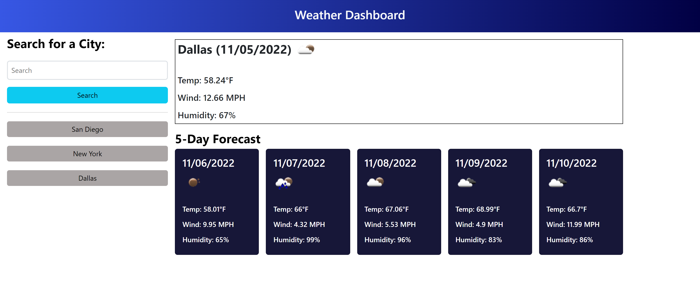

# Weather Dashboard

## Description

I created this dashboard to aid users in determining the current weather for a given city, as well as the weather forecast for the next five days. I learned how to incorporate a server-side API with Javascript functions to create a dynamic and interactible web application.

## Usage

1. Access the  application at this url: https://agarfar.github.io/weather-app/

2. Enter a city name into the search bar and click the search button to generate weather data

3. Click on the listed city names from your search history to display that city's data on the page

4. Search history is persistent through local storage and will display upon reload of the page

## Credits

N/A

## License

N/A